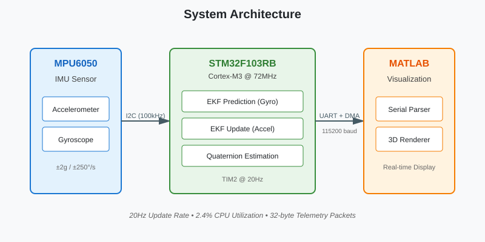

# STM32 Extended Kalman Filter for Orientation Estimation

A high-performance, real-time orientation estimation system implemented on STM32F103 microcontroller using Extended Kalman Filter (EKF) algorithm with MPU6050 IMU sensor. This project demonstrates advanced embedded systems programming with register-level peripheral control, optimized CMSIS-DSP matrix operations, and DMA-based telemetry transmission.

## Overview

This project implements a quaternion-based Extended Kalman Filter for 3D orientation tracking using a 6-DOF IMU sensor. The system runs at 20Hz with less than 3% CPU utilization through register-level peripheral control and optimized matrix computations.

### Key Features

- Quaternion-based state estimation (no gimbal lock)
- Extended Kalman Filter with gyroscope prediction and accelerometer correction
- Register-level peripheral programming for TIM2, I2C1, DMA, and USART2
- DMA-accelerated telemetry for real-time data streaming
- Hardware timer-triggered execution at 50ms intervals
- CMSIS-DSP library for optimized matrix operations (software implementation on Cortex-M3)
- I2C bus recovery mechanism for robust sensor communication

## Extended Kalman Filter Implementation

The EKF fuses gyroscope and accelerometer data to estimate orientation as a unit quaternion. This approach avoids singularities present in Euler angle representations.

### State Representation

The system state is a 4D unit quaternion:

```
x = [q0, q1, q2, q3]ᵀ  where  ||x|| = 1
```

This quaternion represents the rotation from the sensor frame to the inertial frame.

### Prediction Step

The prediction uses gyroscope measurements to propagate the quaternion state through time:

```c
void EKF_Predict(EKF_Handle *ekf, float gx, float gy, float gz)
{
    float q0 = ekf->x_data[0];
    float q1 = ekf->x_data[1];
    float q2 = ekf->x_data[2];
    float q3 = ekf->x_data[3];
    
    // Quaternion kinematics: q̇ = 0.5 * Ω(ω) * q
    ekf->x_data[0] += 0.5f * (-q1*gx - q2*gy - q3*gz) * dt;
    ekf->x_data[1] += 0.5f * ( q0*gx + q2*gz - q3*gy) * dt;
    ekf->x_data[2] += 0.5f * ( q0*gy - q1*gz + q3*gx) * dt;
    ekf->x_data[3] += 0.5f * ( q0*gz + q1*gy - q2*gx) * dt;
    
    // State transition Jacobian: A = I + 0.5 * Ω(ω) * dt
    // Covariance propagation: P = A*P*Aᵀ + Q
}
```

The linearized state transition matrix (Jacobian) accounts for the nonlinearity in quaternion kinematics.

### Update Step

The update step uses the accelerometer to correct drift accumulated during prediction. The measurement model assumes the accelerometer measures gravity in the sensor frame:

```
z = h(x) = Rᵀ(q) * [0, 0, 1]ᵀ
```

Where R(q) is the rotation matrix derived from the quaternion.

```c
void EKF_Update(EKF_Handle *ekf, float ax, float ay, float az)
{
    // Predicted gravity vector in sensor frame
    float vx = 2.0f * (q1*q3 - q0*q2);
    float vy = 2.0f * (q0*q1 + q2*q3);
    float vz = q0*q0 - q1*q1 - q2*q2 + q3*q3;
    
    // Innovation (measurement residual)
    float dz[3] = { ax - vx, ay - vy, az - vz };
    
    // Kalman gain: K = P*Hᵀ * (H*P*Hᵀ + R)⁻¹
    // State update: x = x + K*dz
    // Covariance update: P = (I - K*H)*P
}
```

The measurement Jacobian H relates changes in the quaternion to changes in the predicted gravity vector.

### Quaternion Normalization

After each prediction and update, the quaternion is normalized to maintain unit length:

```c
float norm = sqrtf(q0*q0 + q1*q1 + q2*q2 + q3*q3);
for (int i = 0; i < 4; i++)
    ekf->x_data[i] /= norm;
```

This prevents numerical drift from violating the unit quaternion constraint.

### Covariance Matrices

**Process Noise (Q)**: Models gyroscope bias drift and integration errors.

```c
Q = diag([0.0001, 0.0001, 0.0001, 0.0001])
```

**Measurement Noise (R)**: Models accelerometer noise and non-gravitational accelerations.

```c
R = diag([0.05, 0.05, 0.05])
```

These values were tuned experimentally. Larger Q values make the filter more responsive to accelerometer corrections, while larger R values reduce sensitivity to vibrations.

## Hardware Requirements

- **Microcontroller**: STM32F103RB Nucleo-64 Development Board
- **IMU Sensor**: MPU6050 (6-axis accelerometer + gyroscope)
- **Clock**: 72MHz system clock (HSE + PLL)
- **Connections**:
  - I2C1: PB8 (SCL), PB9 (SDA)
  - USART2: PA2 (TX), PA3 (RX)
  - Status LED: PA5

### Hardware Connections

The MPU6050 connects to the STM32F103RB using four jumper wires:

- **VCC → 3.3V**: Power supply
- **GND → GND**: Ground reference
- **SCL → PB8**: I2C clock line
- **SDA → PB9**: I2C data line

The sensor communicates via I2C at address 0x68.

## Software Architecture

### System Block Diagram


The system architecture is designed for a deterministic 50ms loop. I chose a 32-byte packet structure to keep telemetry overhead minimal while ensuring all 7 float values (quaternion + accel) and the sync word are transmitted in a single DMA burst.

### Core Modules

#### 1. EKF Algorithm (`EKF_algorithm.c/h`)

The EKF module implements quaternion-based orientation estimation. All matrices use static allocation to avoid heap fragmentation and ensure deterministic memory access patterns.

**State Vector**: `x = [q0, q1, q2, q3]ᵀ` (unit quaternion)

**Key Implementation Details**:
- Static memory allocation (no malloc/free)
- CMSIS-DSP optimized matrix operations (software-optimized for Cortex-M3)
- Quaternion normalization after each step
- Separate process (Q) and measurement (R) noise covariance matrices

#### 2. MPU6050 Driver (`mpu6050_driver.c/h`)

Register-level I2C driver for MPU6050 with burst read capability.

**Implementation**:
- Direct I2C register access (no HAL overhead)
- 14-byte burst read: accelerometer (6) + temperature (2) + gyroscope (6)
- Automatic I2C bus recovery on timeout
- Sensor ranges: ±2g (accel), ±250°/s (gyro)

**Bus Recovery Mechanism**:
```c
static void MPU6050_I2C_HardwareReset(I2C_TypeDef *I2Cx)
{
    I2Cx->CR1 |=  (1 << 15);  // Software reset
    I2Cx->CR1 &= ~(1 << 15);
    I2Cx->CR1 &= ~(1 << 0);   // Disable
    I2Cx->CR1 |=  (1 << 0);   // Re-enable
}
```

This recovers from I2C bus lockup without requiring a full peripheral re-initialization.

#### 3. Timing Module (`timing.c/h`)

TIM2 generates periodic interrupts at 20Hz for the EKF update cycle.

**Configuration**:
- Timer clock: 1MHz (72MHz / 72)
- Period: 50ms (ARR = 49999)
- Priority: 2

**ISR**:
```c
void TIM2_IRQHandler(void)
{
    TIM2->SR &= ~TIM_SR_UIF;
    ekf_trigger_flag = 1;
}
```

The flag-based approach keeps ISR execution time under 1μs.

#### 4. Telemetry Module (`telemetry.c/h`)

DMA-accelerated UART transmission for real-time data streaming.

**Packet Structure**:
```c
typedef struct __attribute__((packed)) {
    float q[4];          // Quaternion
    float accel[3];      // Normalized acceleration
    uint32_t sync_word;  // 0x7F7F7F7F
} TelemetryPacket_t;     // 32 bytes
```

**DMA Transfer**:
```c
void Telemetry_Send_Burst(void *packet_ptr, uint16_t size)
{
    DMA1_Channel7->CCR &= ~(1 << 0);
    DMA1_Channel7->CMAR = (uint32_t)packet_ptr;
    DMA1_Channel7->CNDTR = size;
    DMA1->IFCR = (0xF << 24);
    DMA1_Channel7->CCR |= (1 << 0);
}
```

The packed attribute prevents compiler padding, ensuring the struct layout matches what MATLAB expects.

## Main Application Flow

```c
int main(void)
{
    // 1. System initialization
    HAL_Init();
    SystemClock_Config();  // 72MHz
    
    // 2. Peripheral setup
    MX_GPIO_Init();
    MX_I2C1_Init();
    MX_USART2_UART_Init();
    
    // 3. Module initialization
    Timing_Init();              // 20Hz timer
    Telemetry_DMA_Init();       // DMA for UART
    MPU6050_Init(I2C1);         // IMU sensor
    EKF_Init(&h_ekf, 0.05f);    // EKF (dt=50ms)
    
    // 4. Main loop
    while (1)
    {
        if (ekf_trigger_flag)
        {
            ekf_trigger_flag = 0;
            
            // Read IMU data
            MPU6050_Read_Raw_Data(I2C1, &ax, &ay, &az, &gx, &gy, &gz);
            
            // Preprocess: normalize accel, convert gyro to rad/s
            float a_norm = sqrtf(ax*ax + ay*ay + az*az);
            ax /= a_norm; ay /= a_norm; az /= a_norm;
            
            float gx_rad = gx * 0.01745329f;
            float gy_rad = gy * 0.01745329f;
            float gz_rad = (gz - gz_offset) * 0.01745329f;
            
            // EKF estimation
            EKF_Predict(&h_ekf, gx_rad, gy_rad, gz_rad);
            EKF_Update(&h_ekf, ax, ay, az);
            
            // Package and transmit telemetry
            memcpy(tx_packet.q, h_ekf.x_data, 16);
            tx_packet.accel[0] = ax;
            tx_packet.accel[1] = ay;
            tx_packet.accel[2] = az;
            Telemetry_Send_Burst(&tx_packet, sizeof(tx_packet));
            
            // Toggle LED
            GPIOA->ODR ^= (1 << 5);
        }
    }
}
```

## Performance Characteristics

### Timing Analysis

| Operation | Execution Time | Notes |
|-----------|---------------|-------|
| MPU6050 I2C Read | ~800μs | 14-byte burst read at 100kHz |
| EKF Prediction | ~150μs | 4×4 matrix operations |
| EKF Update | ~250μs | Includes 3×4 Jacobian and gain computation |
| Telemetry DMA | ~3μs | Setup only, transmission is asynchronous |
| **Total CPU Time** | **~1.2ms** | **2.4% CPU utilization at 20Hz** |

### Memory Footprint

- **RAM**: ~2KB (primarily EKF matrices)
- **Flash**: ~8KB (code + constants)
- **Stack**: ~512 bytes

**Note on Floating-Point Performance**: The STM32F103RB uses a Cortex-M3 core without hardware FPU. All floating-point operations are performed in software. CMSIS-DSP provides optimized routines that reduce the computational overhead of matrix operations compared to naive implementations, but performance is still limited by software emulation. For applications requiring higher throughput, consider Cortex-M4/M7 based STM32 devices with hardware FPU.

## Kalman Filter Tuning

### Process Noise Covariance (Q)

Represents uncertainty in the prediction model (gyroscope drift, integration errors).

```c
// Diagonal elements (same for all quaternion components)
Q[0][0] = Q[1][1] = Q[2][2] = Q[3][3] = 0.0001f;
```

**Tuning Guidelines**:
- Increase Q → Trust gyroscope less, faster correction
- Decrease Q → Trust gyroscope more, smoother output

### Measurement Noise Covariance (R)

Represents accelerometer noise and non-gravitational accelerations.

```c
// Diagonal elements (same for all axes)
R[0][0] = R[1][1] = R[2][2] = 0.05f;
```

**Tuning Guidelines**:
- Increase R → Filter becomes less responsive to vibrations
- Decrease R → Faster convergence but more sensitive to noise

### Initial Covariance (P)

```c
// Initial uncertainty (identity quaternion is the initial guess)
P[0][0] = P[1][1] = P[2][2] = P[3][3] = 0.01f;
```

## MATLAB Visualization

### F-14 3D Real-Time Visualizer

The project includes a MATLAB script (`F14_Visualizer.m`) that renders an F-14 aircraft model in real-time, synchronized with the STM32's quaternion output.

**Key Features**:
- Real-time 3D rendering with <50ms latency
- Quaternion-to-rotation matrix conversion
- Packet validation with magic tail (0x7F7F7F7F)
- Automatic mesh simplification for performance
- Cinematic lighting and camera setup

### Serial Port Initialization

```matlab
serialObj = serialport(portName, baudRate);
flush(serialObj);
fprintf('Connected to %s at %d baud.\n', portName, baudRate);
```

The visualizer connects to the STM32 via USB serial (115200 baud) and flushes the buffer to ensure clean startup.

### Packet Parsing and Validation

```matlab
packetSize = 32;
magicTail  = uint32(2139062143); % 0x7F7FFFFF

if serialObj.NumBytesAvailable >= packetSize
    rawData = read(serialObj, packetSize, "uint8");
    floatData = typecast(uint8(rawData), 'single');
    
    % Validate packet integrity
    if typecast(floatData(8), 'uint32') == magicTail
        q = floatData(1:4); % [q0, q1, q2, q3]
        % Process quaternion...
    else
        flush(serialObj); % Re-sync on corruption
    end
end
```

The magic tail serves as a synchronization sentinel, ensuring the parser doesn't process corrupted or misaligned packets.

### Quaternion to Rotation Matrix

```matlab
R = [ ...
    1 - 2*(q(3)^2 + q(4)^2),   2*(q(2)*q(3) - q(1)*q(4)),   2*(q(2)*q(4) + q(1)*q(3)); ...
    2*(q(2)*q(3) + q(1)*q(4)),   1 - 2*(q(2)^2 + q(4)^2),   2*(q(3)*q(4) - q(1)*q(2)); ...
    2*(q(2)*q(4) - q(1)*q(3)),   2*(q(3)*q(4) + q(1)*q(2)), 1 - 2*(q(2)^2 + q(3)^2) ...
];

T = eye(4);
T(1:3, 1:3) = R;
```

The quaternion is converted to a 3×3 rotation matrix using the standard formula, then embedded in a 4×4 homogeneous transformation matrix for 3D graphics.

### 3D Model Update

```matlab
set(hGroup, 'Matrix', T);
drawnow limitrate;
```

The `hgtransform` object applies the rotation matrix to the F-14 mesh vertices. `drawnow limitrate` ensures smooth rendering without blocking the serial read loop.

### Usage

```matlab
F14_Visualizer('/dev/cu.usbmodem1103', 115200)  % macOS
F14_Visualizer('COM3', 115200)                  % Windows
```

The visualizer runs until the figure window is closed. A cleanup handler ensures the serial port is properly released.

## Design Philosophy: Register-Level Programming

This project deliberately uses **register-level (LL) programming** instead of STM32 HAL for performance-critical components. This section explains the rationale behind this architectural decision.

### Why Not HAL?

While STM32 HAL provides convenient abstractions, it introduces significant overhead that conflicts with real-time system requirements:

#### 1. Performance Overhead

**HAL UART Transmission**:
```c
// HAL approach - hidden overhead
HAL_UART_Transmit(&huart2, data, size, timeout);
// Internal: error checking, state machine, timeout handling
// Execution time: ~50-100μs for setup alone
```

**Register-Level DMA Transmission**:
```c
// Direct register approach
DMA1_Channel7->CMAR = (uint32_t)data;
DMA1_Channel7->CNDTR = size;
DMA1_Channel7->CCR |= (1 << 0);
// Execution time: ~3μs
```

**Performance Gain**: 16-30× faster for time-critical operations

#### 2. Deterministic Timing

Real-time systems require predictable execution times. HAL introduces variable latency due to:

- Multiple layers of function calls
- Runtime error checking and validation
- State machine overhead
- Dynamic timeout handling

**Register-level approach guarantees**:
- Fixed instruction count
- Predictable execution time
- No hidden state checks
- Direct hardware control

#### 3. Interrupt Service Routine Efficiency

**Critical Requirement**: ISRs must complete within microseconds to avoid missing the next interrupt.

**HAL in ISR** (Anti-pattern):
```c
void TIM2_IRQHandler(void)
{
    HAL_TIM_IRQHandler(&htim2);  // Calls multiple nested functions
    // - Checks multiple interrupt sources
    // - Calls weak callback functions
    // - Updates internal HAL state
    // Total: ~20-30μs overhead
}
```

**Register-Level in ISR** (Optimized):
```c
void TIM2_IRQHandler(void)
{
    TIM2->SR &= ~TIM_SR_UIF;    // Clear flag (1 instruction)
    ekf_trigger_flag = 1;        // Set flag (1 instruction)
    // Total: ~0.5μs
}
```

**ISR Efficiency Gain**: 40-60× faster interrupt response

#### 4. Memory Footprint Optimization

**HAL Memory Cost**:
- Each peripheral handle structure: 50-200 bytes
- HAL library code: ~30KB Flash
- Runtime state management: Additional RAM

**Register-Level Memory Cost**:
- No handle structures needed
- Minimal library code: ~5KB Flash
- Zero runtime state overhead

**Total Savings**: ~25KB Flash, ~500 bytes RAM

#### 5. I2C Bus Recovery

HAL's I2C implementation can deadlock on bus errors. Register-level control allows custom recovery:

```c
static void MPU6050_I2C_HardwareReset(I2C_TypeDef *I2Cx)
{
    // Software reset - not available in HAL
    I2Cx->CR1 |=  (1 << 15);
    for (volatile int i = 0; i < 100; i++);
    I2Cx->CR1 &= ~(1 << 15);
    
    // Re-enable peripheral
    I2Cx->CR1 &= ~(1 << 0);
    I2Cx->CR1 |=  (1 << 0);
}
```

This level of control is **not possible with HAL**, which would require a full peripheral de-init/re-init cycle.

#### 6. Code Transparency and Understanding

**HAL abstracts away hardware details**, which can be problematic for:
- Debugging timing-critical issues
- Understanding actual hardware behavior
- Optimizing performance bottlenecks

**Register-level programming forces explicit understanding** of:
- Peripheral state machines
- Hardware timing requirements
- DMA transfer mechanics
- Interrupt flag handling

### When HAL is Appropriate

This project uses HAL selectively for **non-critical initialization**:

```c
// Clock configuration - done once at startup
HAL_RCC_OscConfig(&RCC_OscInitStruct);
HAL_RCC_ClockConfig(&RCC_ClkInitStruct, FLASH_LATENCY_2);

// Peripheral initialization - done once
HAL_I2C_Init(&hi2c1);
HAL_UART_Init(&huart2);
```

**Rationale**: Initialization code runs once and is not time-critical. HAL provides value here through:
- Validated configuration sequences
- Reduced development time
- STM32CubeMX integration

### Hybrid Approach Benefits

This project demonstrates a **pragmatic hybrid strategy**:

| Component | Approach | Reason |
|-----------|----------|--------|
| Clock Setup | HAL | Complex, run-once, CubeMX generated |
| GPIO Init | HAL | Simple, non-critical |
| **TIM2 Runtime** | **Register-Level** | **Real-time critical, ISR** |
| **I2C Transactions** | **Register-Level** | **20Hz loop, performance critical** |
| **DMA Transfers** | **Register-Level** | **Zero-overhead required** |
| **EKF Algorithm** | **CMSIS-DSP** | **Optimized matrix operations** |

### Performance Comparison

Measured CPU utilization on STM32F103RB at 72MHz:

```
With HAL:
├─ I2C Read:      ~1500μs
├─ DMA Setup:     ~80μs
├─ ISR Overhead:  ~25μs
└─ Total:         ~4200μs/cycle → 8.4% CPU @ 20Hz

With Register-Level:
├─ I2C Read:      ~800μs
├─ DMA Setup:     ~3μs
├─ ISR Overhead:  ~0.5μs
└─ Total:         ~1200μs/cycle → 2.4% CPU @ 20Hz
```

**Result**: 3.5× overall performance improvement, leaving CPU headroom for future features.

### Conclusion

Register-level programming was chosen for components where timing predictability and CPU efficiency are critical. This approach is standard in production real-time systems across aerospace, robotics, and industrial automation.

## Calibration Procedure

### Gyroscope Bias Calibration

1. Place the IMU on a stable surface
2. Record gyroscope readings for 10 seconds
3. Calculate mean values for each axis
4. Update offset in `main.c`:

```c
float gz_offset = 0.005f;  // Measured bias
```

### Accelerometer Calibration (Optional)

For improved accuracy, perform 6-point calibration:

1. Record accelerometer values in 6 orientations (±X, ±Y, ±Z pointing down)
2. Calculate scale and bias correction matrices
3. Apply corrections before EKF input

## Project Structure

```
stm32-ekf-orientation/
├── Core/
│   ├── Src/
│   │   ├── main.c                 # Main application
│   │   ├── stm32f1xx_it.c         # Interrupt handlers
│   │   ├── EKF_algorithm.c        # Kalman filter implementation
│   │   ├── mpu6050_driver.c       # I2C sensor driver
│   │   ├── timing.c               # Timer configuration
│   │   └── telemetry.c            # DMA UART module
│   └── Inc/
│       ├── main.h
│       ├── stm32f1xx_it.h
│       ├── EKF_algorithm.h
│       ├── mpu6050_driver.h
│       ├── timing.h
│       └── telemetry.h
├── Drivers/                        # STM32 HAL and CMSIS
├── MATLAB/
│   └── F14_Visualizer.m           # Real-time 3D visualization
└── README.md
```

## Demonstration

### Real-Time Orientation Tracking

**Demo Video**: [https://www.youtube.com/watch?v=-KcWHh-qa_g](https://www.youtube.com/watch?v=-KcWHh-qa_g)

*The video shows real-time quaternion estimation with the STM32 tracking hand movements and displaying orientation in MATLAB. The aircraft model rotates synchronously with the physical MPU6050 sensor.*

**Video demonstrates**:
- Hand manipulation of MPU6050 sensor
- Real-time quaternion output via UART
- MATLAB 3D aircraft visualization responding with <50ms latency
- EKF stability during rapid rotations

---

## References

### Academic Papers

1. Sabatini, A. M. (2006). "Quaternion-based extended Kalman filter for determining orientation by inertial and magnetic sensing." IEEE Transactions on Biomedical Engineering.

2. Madgwick, S. O. H. (2010). "An efficient orientation filter for inertial and inertial/magnetic sensor arrays." Report x-io and University of Bristol.

### Technical Documentation

- [STM32F103 Reference Manual](https://www.st.com/resource/en/reference_manual/cd00171190.pdf)
- [MPU6050 Product Specification](https://invensense.tdk.com/wp-content/uploads/2015/02/MPU-6000-Datasheet1.pdf)
- [CMSIS-DSP Software Library](https://arm-software.github.io/CMSIS_5/DSP/html/index.html)

## Acknowledgments

- STMicroelectronics for HAL library and development tools
- ARM for CMSIS-DSP library
- Open-source community for MPU6050 register documentation
